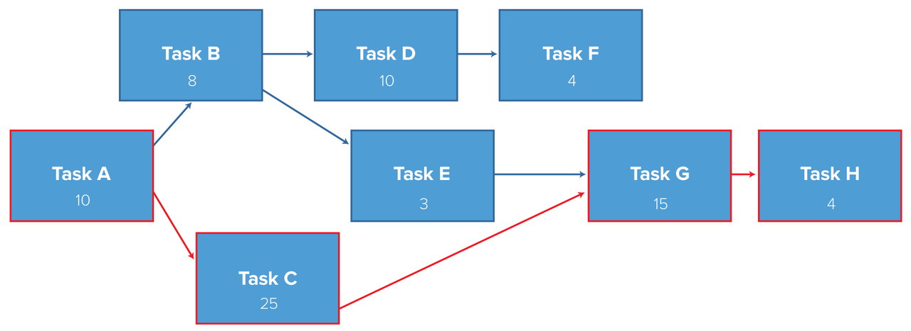

# CriticalPathMethod

<h2>Concept:</h2>
The critical path method (CPM), or critical path analysis (CPA), is an algorithm for scheduling a set of project activities.It is commonly used in conjunction with the program evaluation and review technique (PERT). A critical path is determined by identifying the longest stretch of dependent activities and measuring the time required to complete them from start to finish.

<h2>Steps to use:</h2> 
1. Clone or download the project
2. cd to the project directory 
3. run this command in the terminal: python main.py /samples/sched1.csv
4. You can also use other input samples in the samples folder for testing the output.

<h2>Pre-requisite:</h2>
Python version- Python 2.7.15rc1

<h2>Glossary:</h2>
1. ES = Early Start
2. EF = Early Finish
3. LS = Late Start
4. LF = Late Finish

